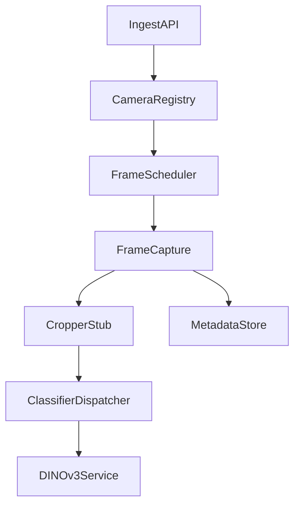

# Crop Service PRD

## Problem Statement
We need a scalable service that ingests per-camera crop metadata (JSON) and video sources, periodically captures frames, produces table crops, and forwards those crops to a downstream classifier. The system must support multiple CCTV cameras, tolerate periodic re-segmentation of table locations, and provide stable table identifiers across minor layout changes.

## Goals
- Ingest crop JSON and video references per camera.
- Capture frames every N seconds per camera.
- Produce crops for each table region and dispatch to classifier.
- Maintain stable table IDs across minor shifts; detect merges/splits.
- Provide integration points for future crop-regeneration model/script.
- Support both JSON file storage and Postgres persistence.

## Non-Goals (Phase 1)
- Implement the cropper model/script itself.
- Train or host the DINOv3 classifier.
- Real-time UI labeling flow (only data hooks for it).

## Personas and Use Cases
- Onboarding operator: labels initial table IDs from crops.
- Ops engineer: monitors multi-camera pipeline health.
- ML pipeline owner: consumes crop outputs for inference.

## Success Metrics
- End-to-end crop dispatch latency < 3s (median).
- Camera throughput supports 1 fps sampling across 8+ cameras.
- 99.5% uptime for ingestion and scheduling.
- <1% missing crops per camera per hour.

## Inputs
- Crop JSON payload (schema below).
- Video source per camera (RTSP/HTTP/local path).
- Optional trigger to refresh crop JSON via external script.

## Outputs
- Crop images dispatched to classifier service.
- Metadata events per crop (camera_id, table_id, frame_index).
- Optional persisted state (latest crop JSON, mapping, history).

## API Endpoints (Service Contract)
- `POST /cameras/register`
  - Body: `{ camera_id, video_source, crop_json? }`
  - Registers a camera and optional initial crop JSON.
- `POST /cameras/{camera_id}/crop-json`
  - Body: `{ crop_json }`
  - Updates the latest crop JSON for a camera.
- `POST /cameras/{camera_id}/refresh`
  - Triggers a refresh call to the external cropper/updater (stub in phase 1).
- `GET /cameras`
  - Returns camera registry status and last capture metadata.
- `GET /healthz`

## Configuration
- `CAPTURE_INTERVAL_SECONDS`: frame sampling cadence per camera.
- `CLASSIFIER_ENDPOINT`: downstream classifier URL.
- `CROPS_BASE_DIR`: base path for relative crop file paths.
- `CROP_SERVICE_STATE`: JSON state path (phase 1).
- `VIDEO_SOURCE_TIMEOUT_SECONDS`: max time to wait per frame capture.
- `MAX_IN_FLIGHT_PER_CAMERA`: throttles dispatch to classifier.

## Data Contract (Crop JSON)
Example schema (provided by upstream cropper):
```json
{
  "video_name": "string",
  "frame_index": 0,
  "frame_width": 1280,
  "frame_height": 720,
  "tables": [
    {
      "id": 0,
      "rotated_bbox": {
        "center": [0.0, 0.0],
        "size": [0.0, 0.0],
        "angle": 0.0,
        "corners": [[0.0, 0.0]]
      },
      "saved": true,
      "crop_file": "crops/table_00.jpg",
      "crop_size": {"width": 0, "height": 0}
    }
  ]
}
```

## Classifier Dispatch Payload
- `file`: image crop (multipart form)
- Metadata fields: `camera_id`, `table_id`, `frame_index`, `video_name`

## Storage (Phase 1 and Phase 2)
### Phase 1: JSON
- `crop_service_state.json`
  - `cameras.{camera_id}.video_source`
  - `cameras.{camera_id}.crop_json`
  - `cameras.{camera_id}.last_capture_ts`
  - `cameras.{camera_id}.last_frame_index`

### Phase 2: Postgres (outline)
- `camera_sources` (id, restaurant_id, camera_id, video_source, created_at)
- `camera_crop_state` (camera_id, crop_json, updated_at)
- `crop_dispatch_log` (camera_id, table_id, frame_index, dispatched_at, status)

## Architecture (Phase 1)


### Components
- Ingest API: register cameras, update crop JSON, status endpoints.
- Camera Registry: stores camera configs, latest crop JSON, last run.
- Frame Scheduler: triggers frame capture every N seconds.
- Frame Capture: grabs current frame from video source (stub).
- Cropper Stub: calls external cropper/updater in future.
- Classifier Dispatcher: posts crops to DINOv3 service.
- Metadata Store: JSON now, Postgres later.

## Table Identity and Merging (Future)
- Maintain `table_id` across updates by matching new crop regions to prior
  ones using IoU, centroid distance, and area similarity thresholds.
- Detect merges: multiple previous tables match a single new region.
- Emit merge events: `table_merge(old_ids, new_id)`.

## Reliability and Scaling
- Per-camera worker loops to isolate latency.
- Backpressure: skip frames if classifier queue is saturated.
- Retry strategy: exponential backoff for classifier POSTs.
- Idempotency: dedupe by `(camera_id, frame_index, table_id)`.
- Failure handling:
  - Missing crop file: log and skip.
  - Classifier timeout: retry with capped backoff.
  - Crop JSON stale: continue last-known or request refresh.
  - Camera unreachable: mark degraded and continue others.

## Observability
- Metrics: crop dispatch latency, per-camera frame rate, error counts.
- Logs: structured logs with `camera_id` and `frame_index`.
- Health: `/healthz`, `/cameras` endpoints.

## Scheduler Behavior
- Each camera is processed on a fixed interval with a best-effort loop.
- If processing exceeds the interval, skip the next tick (no backlog).
- Dispatch queue is bounded per camera to avoid runaway memory use.

## Security
- Auth for ingestion endpoints (API key or JWT).
- TLS for all network transport.
- Restrict video source access to internal network.

## Integration and Merge Notes
- Keep DINOv3 classifier separate as an external service.
- Cropper/updater runs out-of-process; expose a stable API for refresh.
- Schema version the crop JSON to allow future fields without breakage.
- Provide a clear registry API so other services can register cameras.
- Crop service is the single source of truth for crop JSON updates.

## Rollout Plan
- Phase 1: skeleton service + JSON storage.
- Phase 2: Postgres persistence, queue-backed dispatcher.
- Phase 3: merge/split detection and labeling workflow.

## Open Risks
- RTSP connectivity instability.
- Crop file availability timing from upstream cropper.
- Multi-camera resource saturation without queueing.
